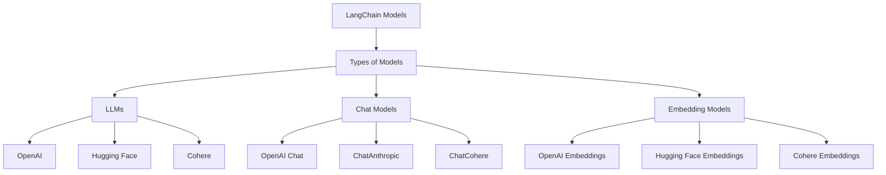

<!-- @format -->

# **LangChain Components**

LangChain consists of six core components that help build **powerful AI-driven applications**.

---

## **1️⃣ Models**

### **What are Models?**

Models in LangChain refer to **LLMs (Large Language Models)** like **GPT-4, Claude, Gemini, Llama, Mistral**, etc. These models generate responses based on input prompts.
Models are the **Core Interfaces** through which you interact with **AI Models**.

### **Types of Models**

🔹 **LLMs** – Handles text-based tasks (e.g., OpenAI GPT, Mistral, Claude)  
🔹 **Chat Models** – Designed for conversational AI (e.g., GPT-4 Chat)  
🔹 **Text Embedding Models** – Convert text into vectors for **semantic search**

### **Use Case**

✅ GPT-4 for **Q&A systems**  
✅ Embedding models (e.g., OpenAI embeddings) for **semantic search**

---

## **2️⃣ Prompts**

### **What are Prompts?**

Prompts define the **input format** for models. LangChain provides tools to create **dynamic and reusable prompts**.

### **Types of Prompting**

🔹 **Basic Prompting** – Simple text input (e.g., “Summarize this document”)  
🔹 **Few-Shot Prompting** – Provides examples to guide the model  
🔹 **Chain-of-Thought (CoT) Prompting** – Helps in **reasoning** by breaking down complex problems

### **Use Case**

✅ Standardized prompts for **customer support chatbots**  
✅ Chain-of-Thought prompts for **AI-powered coding assistants**

---

## **3️⃣ Chains**

### **What are Chains?**

Chains allow multiple **LLM calls, APIs, and data sources** to work together in a sequence.

### **Types of Chains**

🔹 **LLM Chain** – Uses **an LLM with a prompt template**  
🔹 **Sequential Chain** – Combines multiple steps (e.g., **input → process → output**)  
🔹 **Retrieval Chain** – Fetches external knowledge **before** sending queries to LLM

### **Use Case**

✅ Multi-step **resume analysis system**  
✅ Research assistant fetching **documents, summarizing, and answering queries**

---

## **4️⃣ Memory**

### **What is Memory?**

Memory allows the system to **remember previous interactions** and provide **context-aware** responses.

**LLM API calls are stateless.**

### **Types of Memory**

🔹 **ConversationBufferMemory** – Stores recent conversations  
🔹 **ConversationSummaryMemory** – Summarizes past conversations  
🔹 **Vector-based Memory** – Uses embeddings for **long-term recall**

### **Use Case**

✅ AI **chatbots that remember user history**  
✅ Virtual assistants that **adapt responses based on past interactions**

---

## **5️⃣ Indexes**

### **What are Indexes?**

1. Indexes organize **large datasets** for efficient retrieval. This is useful when working with **PDFs, databases, or document repositories**.
2. Indexes connect your application to external knowledge- such as **PDFs, databases, or document repositories**.

### **Types of Indexing**

🔹 **Vector Indexes** – Store **text embeddings** for **semantic search**  
🔹 **Document Indexes** – Store and retrieve **raw text or structured documents**

### **Use Case**

✅ AI-powered **legal document search engine**  
✅ Semantic search for **research papers and knowledge bases**

---

## **6️⃣ Agents**

### **What are Agents?**

Agents use **LLMs + Tools** to make **dynamic decisions** in real time. Instead of following **predefined steps**, they decide the best course of action based on user queries.

### **Agent Components**

🔹 **LLM** – The core AI model  
🔹 **Tools** – APIs, databases, and other **external tools**  
🔹 **Memory** – Context retention for better **decision-making**

### **Types of Agents**

🔹 **Zero-shot Agent** – Responds **without prior examples**  
🔹 **Self-ask Agent** – Breaks complex questions into **smaller steps**  
🔹 **Multi-Agent Systems** – Uses multiple agents **collaboratively**

### **Use Case**

✅ AI **financial advisor that fetches live stock data**  
✅ Multi-agent **AI research assistant** that analyzes multiple documents

---

# **Summary Table**

| Component   | Purpose                                | Example Use Case                                 |
| ----------- | -------------------------------------- | ------------------------------------------------ |
| **Models**  | LLMs that process text                 | GPT-4 for Q&A                                    |
| **Prompts** | Define how inputs are structured       | Chain-of-Thought prompting for reasoning         |
| **Chains**  | Connect multiple AI calls & tools      | Research assistant fetching and summarizing data |
| **Memory**  | Retains past conversations for context | AI chatbot remembering user history              |
| **Indexes** | Store & retrieve documents efficiently | AI-powered legal document search                 |
| **Agents**  | Dynamic decision-making with AI        | AI agent fetching stock data                     |

---
